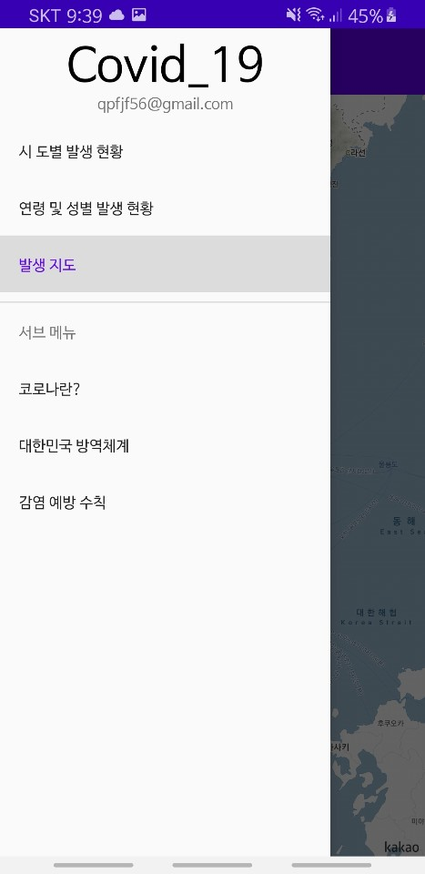

# Covid19_

## 코로나 현황판 어플리케이션
-----------------------------------------------------------------------------------------
어떤 어플리케이션인가요 ?   
공공데이터를 활용하여 국내 코로나 감염 현황을 알려주는 알림 어플리케이션 입니다.
------------------------------------------------------------------------------------------

## 사용법
### 1. 메뉴를 선택
{: width="220"}
### 2. 시도별 감염현황
{: width="220"}
### 3. 연령 및 성별 감염현황
{: width="220"}
### 4. 감염현황 지도로 보기
{: width="220"}
### 5. 코로나 정보확인
{: width="220"}
### apk 다운로드 : [앱 다운로드](https://drive.google.com/file/d/1YRZrlij5qceGwtip9ykL9CpZu6vbNkmL/view?usp=sharing, "앱 다운로드")

